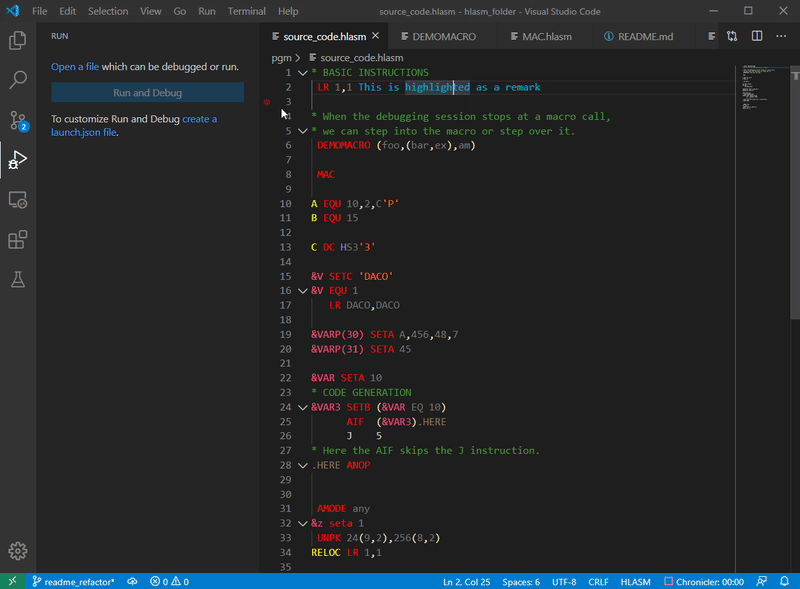

# HLASM Language Support

HLASM Language Support is an extension for [Visual Studio Code](https://code.visualstudio.com/) (and [Theia](https://theia-ide.org/)) that adds support for the High Level Assembler language. It provides code completion, highlighting and navigation features, detects common mistakes in the source, and lets you trace the evaluation of the conditional assembly source code, using a modern debugging interface.

The extension is available on the [Visual Studio Marketplace](https://marketplace.visualstudio.com/items?itemName=broadcomMFD.hlasm-language-support). You can install it in a standard way from within the Visual Studio Code.

HLASM Language Support is also part of [Code4z](https://marketplace.visualstudio.com/items?itemName=broadcomMFD.code4z-extension-pack), an all-round package that offers a modern experience for mainframe application developers, including [COBOL Language Support](https://marketplace.visualstudio.com/items?itemName=broadcomMFD.cobol-language-support), [Explorer for Endevor](https://marketplace.visualstudio.com/items?itemName=broadcomMFD.explorer-for-endevor), [Zowe Explorer](https://marketplace.visualstudio.com/items?itemName=Zowe.vscode-extension-for-zowe), [Debugger for Mainframe](https://marketplace.visualstudio.com/items?itemName=broadcomMFD.debugger-for-mainframe) and [COBOL Control Flow](https://marketplace.visualstudio.com/items?itemName=broadcomMFD.ccf) extensions.

## Useful Information
- If you have a question about the functionalities of the extension, or come across a problem, [file an issue](https://github.com/eclipse/che-che4z-lsp-for-hlasm/issues).
- Contributions are always welcome! Please see the [CONTRIBUTING.md](CONTRIBUTING.md) for more information.
- See the project [wiki](https://github.com/eclipse/che-che4z-lsp-for-hlasm/wiki/) for project documentation. 
- For instructions on how to build and install the project from source, see the project [wiki](https://github.com/eclipse/che-che4z-lsp-for-hlasm/wiki/Build-instructions).
- All [releases](https://github.com/eclipse/che-che4z-lsp-for-hlasm/releases) are available here on GitHub.
- Any and all feedback is appreciated and welcome!

## Language Features

The HLASM Language Support extension parses and analyzes all parts of a HLASM program. It resolves all ordinary symbols, variable symbols and checks the validity of most instructions. The extension supports conditional and unconditional branching and can define global and local variable symbols. It can also expand macros and COPY instructions.

## LSP Features
### Highlighting
The HLASM Language Support extension highlights statements with different colors for labels, instructions, operands, remarks and variables. Statements containing instructions that can have operands are highlighted differently to statements that do not expect operands. Code that is skipped by branching AIF, AGO or conditional assembly is not colored.

### Autocomplete
Autocomplete is enabled for the instruction field. While typing, a list of instructions starting with the typed characters displays. Selecting an instruction from the list completes it and inserts the default operands. Variables and sequence symbols are also filled with a value from their scope.

### Go To Definition and Find All References
The extension adds the 'go to definition' and 'find all references' functionalities. Use the 'go to definition' functionality to show definitions of variable symbols, ordinary symbols and macros, or open COPY files directly. Use the 'find all references' functionality to show all places where a symbol is used.

### Macro Tracer

The macro tracer functionality allows you to track the process of assembling HLASM code. It lets you see step-by-step how macros are expanded and displays values of variable symbols at different points during the assembly process. You can also set breakpoints in problematic sections of your conditional assembly code. 

The macro tracer is not a debugger. It cannot debug running executables, only track the compilation process.

