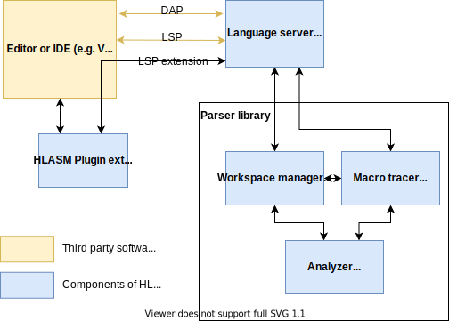

The architecture is based on the way modern code editors and IDEs are extended to support additional languages. We chose to implement [Language Server Protocol](https://microsoft.github.io/language-server-protocol/) (LSP), which is supported by a majority of contemporary editors.

In LSP, the two parties that communicate are called a *client* and a *language server*. A simple example is displayed in the picture above. The client runs as a part of an editor. The language server may be a standalone application that is connected to the client by a pipe or TCP. All language-specific user actions (for example the Go to definition command) are transformed into standard LSP messages and are sent to the language server. The language server then analyzes the source code and sends back a response, which is then interpreted and presented to the user in editor-specific way. This architecture makes possible to only have one LSP client implementation for each code editor, which may be reused by all programming languages. And vice versa, every language server may be easily used by any editor that has an implementation of the LSP client.

To add support for HLASM, we have implemented the LSP language server and written a lightweight extension to an editor, which uses an already existing implementation of the LSP client. To implement source code highlighting, we had to extend the protocol with a new notification. This notification is used for transferring information from the language server to the VS Code client, which is extended to highlight code in editor based on the incoming custom notifications.

In this chapter, we further decompose the project into smaller components and describe their relations. The two main components are the parser library and the language server — an executable application that uses the parser library. An overview of the architecture is in the picture below. The architecture of whole project is shown in [[Architecture visualization]].

Language server component
-------------------------

The responsibility of the language server component is to maintain the LSP session, convert incoming JSON messages and use the parser library to execute them. The functionality includes:

-   reading LSP messages from either a standard input or TCP and writing responses

-   parsing JSON RPC to C++ structures, so they can be further used

-   serializing C++ structures into JSON, so it can be sent back to the client

-   asynchronous request handling: when a user makes several consecutive changes to a source code, parsing on every change is not needed

Parser library component
------------------------

Parser library is the core of the project — it encapsulates the analyzer, which provides all parsing capabilities, and workspace manager, which keeps track of open files in the editor and manages their dependencies. It has to keep the representation of workspaces and files in the parser library exactly the same as the user sees in the editor. It also starts the analyzer when needed, manages workspace configuration and provides external macro and copy libraries to analyzer.

### Parser library API

The parser library API is based on LSP — every relevant request and notification has a corresponding method in the parsing library.

At first, the API implements the LSP notifications that ensure the editor state synchronization. Apart from working with individual files, the LSP also supports workspaces. A workspace is basically just a folder that contains related source codes. The LSP also supports working with multiple workspaces at the same time. We use it when searching for dependencies of HLASM source codes (macros, and copy files).

The parser library has the exact contents of all files in open workspaces. To achieve that, there is a file watcher running in the LSP client that notifies the server when any of the HLASM source files is changed outside of editor. For example, when a user deletes an external macro file, the parser library should react by reporting that it cannot find the macro.

The list of necessary editor state synchronization notifications follows:

-   Text synchronization notifications (`didOpen`, `didChange`, `didClose`) that inform the library about files that are currently open in the editor and their exact contents.

-   `DidChangeWorkspaceFolders` notification that informs the library when a workspace has been opened or closed.

-   `DidChangeWatchedFiles` notification

Next, the API implements the requests and notifications that provide the parsing results, specifically:

-   `publishDiagnostics` notification. A diagnostic is used to indicate a problem with source files, such as a compiler error or a warning. The parser library provides a callback to let the language server know that diagnostics have changed.

-   Callback for highlighting information provision.

-   Language feature requests (`definition`, `references`, `hover`, `completion`), which provide information needed for proper reaction of the editor on user actions.

### Analyzer

The analyzer processes a single HLASM file. It takes the contents of a source file by common string and a callback that can parse external files with specified name. It provides a list of diagnostics linked to the file, highlighting, list of symbol definitions, etc.

The analysis of HLASM code includes:

-   recognition of statements and their parts (lexing and parsing)

-   interpretation of instructions that should be executed in compile time

-   reporting of problems with the source by producing LSP diagnostics

-   providing highlighting and LSP information

A HLASM source files have dependencies — other files that define macros or files brought in by the COPY instruction. Dependencies are only discovered during the processing of files, so it is not possible to provide the files with macro definitions beforehand. The analyzer gets a callback that finds a file with specified name, parse its contents and return it as a list of parsed statements.

Client-side VS Code extension
-----------------------------

The VS Code extension component ensures seamless integration with the editor. Its functions are:

-   to start the HLASM language server and the LSP client that comes with VS Code, and to create a connection between them.

-   to implement extension of the LSP protocol for enabling server-side highlighting. The extended client parses the information from the server and uses VS Code API to actually color the text in the editor.

-   to implement support for editing lines with continuations — when the user types something in front of the continuation character, it should stay in place.

Macro tracer
------------

The macro tracer gives a possibility to trace the compilation of HLASM source code in a way similar to common debugging. This is the reason why we chose to implement support for the [Debug Adapter Protocol](https://microsoft.github.io/debug-adapter-protocol/) (DAP). It is very similar to LSP, so most of the code implementing LSP in the language server component may be reused for both protocols.

The language server component communicates with the macro tracer component in the parser library. Its API mirrors the requests and events of DAP.

The main responsibilities of the macro tracer include:

-   `launch`, `continue`, `next`, `stepIn` and `disconnect` requests, which allow the user to control the flow of the compilation

-   `SetBreakpoints`, which transfers the information about breakpoints that the user has placed in the code

-   `Threads`, `StackTrace`, `Scopes` and `Variables` requests to allow the DAP client to retrieve information about the current processing stack (stack of nested macros and copy instructions), available variable symbols and their values

-   `stopped`, `exited` and `terminated` events to let the DAP client know about state of traced source code

The macro tracer communicates with the workspace manager to retrieve the content of the traced files. It analyzes the source file in a separate thread and gets callbacks from the analyzer before each statement is processed. In the callback, the tracer puts the thread to sleep and waits for user interaction. During this time, it is possible to retrieve all variable and stack information from the processing to display it to the user.
