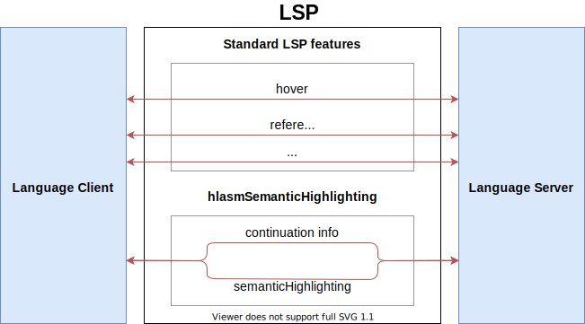

The frontend of the project is implemented as an extension to a modern IDE instead of creating a completely new GUI. This approach has the advantage of providing a familiar environment and workflow that the developers are used to.

There are several IDEs that currently (natively) support LSP, such as *Eclipse Che* and *Eclipse IDE*, *vim8*, *Visual Studio* and *Visual Studio Code* and many more. Others, for example *IntelliJ*, have plugins which add the support for LSP.

Our IDE choice is *Visual Studio Code*, due to its popularity and lightweight design. Conveniently, *Theia*, a web-based IDE, supports VSCode extensions, therefore our plugin works with *Theia* as well.

Standard LSP Extension
----------------------

The core of the extension is an activation event which starts the plugin for VSCode.

Upon activation, the *Language Client* and *[[Language server]]* are started as child processes of VSCode and a pipe is open for their communication. The LSP communication and its features are handled by the *vscodelc* package.

To be independent of pipes, we have added an option to use TCP, which assigns a random free port for TCP communication.

DAP Extension
-------------

The [*Macro Tracer*](https://github.com/eclipse/che-che4z-lsp-for-hlasm/wiki/Macro-tracer)  is implemented using DAP, which is also supported out-of-the-box by VSCode. Similarly to LSP TCP support, we dynamically assign a random free port for DAP communication during  activation.

Additional implemented features
-------------------------------

To simplify the work with HLASM in modern editors, several features are added to the extension. These additions are specific to Visual Studio Code (and Theia) and are not a part of the LSP specification.

### Language Detection

The usual workflow with the extension begins with downloading HLASM source code from a mainframe. Typically, these files will not have any file extension and even if they do, they might differ across various products.

To cope with this problem, there are several mechanisms that help the user to recognize the file as HLASM automatically:

- **Macro Detection**  
Each file starting with the line *MACRO* (with an arbitrary amount of whitespace before and after) is recognized as HLASM.

- **Configuration Files Detection**  
Every file either defined as a program or as a part of a processor group is recognized as HLASM.

- **Wildcards**  
The configuration file *pgm\_conf.json* contains the field *alwaysRecognize*, which consists of user-defined wildcards. Every file that satisfies at least one of these wildcards is recognized as HLASM.

- **Automatic Language Detection**  
    Whenever a user opens a file, its contents are scanned line by line. If the file has a sufficient ratio of HLASM lines to all lines, it is considered to be HLASM.

    The HLASM line recognition is mostly based on a pre-defined set of commonly used instructions. If a line correctly uses one of these instructions, it is counted as a HLASM line. A continued line of a HLASM line is also a HLASM line. If a line exceeds 80 characters, it is not counted as a HLASM line.

    Comment lines and empty lines are skipped and not counted.

    We tested the detection on 11,000 HLASM files and 9,000 non-HLASM files. The best results were observed using a ratio of 4:10, with 88% true positive recognition and 95% true negative recognition.

    Because of the indeterminate outcomes, this method is meant to be used as a fall-back in case all other methods do not suffice.

All detection layers are visualized in the following picture:

### Continuation Handling

Due to historical reasons, HLASM has a limitation of 80 characters per line. Modern languages do not enforce such restrictions and therefore IDEs such as VSCode allow the user to extend their lines freely. This causes 2 major inconveniences.

Firstly, the user must add the continuation character on a specific column manually. Secondly, each time the user types in between the continuation character and the instruction/parameters, the continuation character is pushed from its requisite position and needs to be moved back, again manually.

To improve this behavior, the extension offers an option to activate *Continuation Handling*.

The first problem is solved by adding two editor commands *insertContinuation* and *deleteContinuation*, which, when invoked, insert/delete the continuation character at its correct position.

To improve the second problem, the option overrides standard VSCode commands commonly used when working in the editor such as *type*, *deleteLeft*, *deleteRight*, *cut* and *paste*. They offset the continuation character by removing/adding whitespaces in front of it.

### Configuration Prompt

If a workspace contains a HLASM file, but does not have the configuration files set, the user is prompted to create them. The warning message also offers an option to create templates for them.

### HLASM Semantic Highlighting

To highlight HLASM code, a semantic (server-side) approach is desired. Due to the multi-layered nature of the language, specific parts of the code commonly cannot be properly highlighted unless a previous part was completely processed (parameters for instructions, skipped code thanks to code generation, defined macros, continuations, etc.)

Based on the open [pull request to the VSCode Language Server](https://github.com/microsoft/vscode-languageserver-node/pull/367/files), we added *semanticHighlighting* as an extra feature of LSP. This feature works in a very similar manner, implementing the LSP interfaces that VSCode provides. It works as a notification from the server to the client, containing ranges inside the document and their respective tokens (e.g. instruction, label, parameter, comment.)

We also extended *semanticHighlighting* to *ASMsemanticHighlighting*, which adds the ability to notify the client about a new code layout, specifically the *begin*, *continuation* and *continue* columns. These fields can be set in the HLASM code (via an ICTL instruction) and are required for the *Continuation Handling* feature to work properly. Our client-server communication is shown in the figure below.

