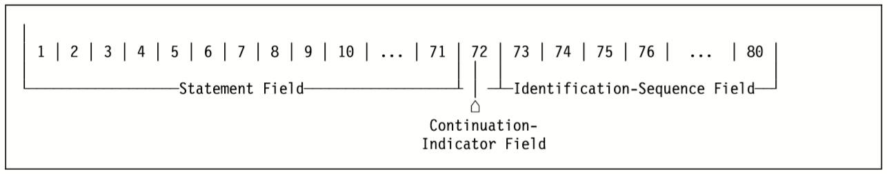

Ordinary assembly languages consist solely of ordinary machine instructions. High-level assemblers generally extend them with features commonly found in high-level programming languages, such as control statements similar to *if, while, for* as well as custom callable macros.

IBM High Level Assembler (HLASM) satisfies this definition and adds other features, which will be described in this section.

Syntax
------

HLASM syntax is similar to a common assembler, but due to historical reasons it has limitations, like line length limited to 80 characters (as that was the length of a punched card line).

### Statement

HLASM program consists of a sequence of *statements*, which are used to produce both compile-time code and run-time code (see [Assembling]). A statement consists of four fields separated by spaces that can be split into more lines using continuations (see \[Continuation\]). Following are the existing fields:

-   **Name field** — Serves as a place for named constants that are to be used in the code. This field is optional, but, when present, it must start at the begin column of a line.

-   **Instruction field** — The only mandatory field, represents the instruction that is executed. It must not begin in the first column, as it would be interpreted as a name field.

-   **Operands field** — Field for instruction operands, located immediately after instruction field. Individual operands must be separated by a comma, and, depending on the specific instruction, can be either blank, in a form of an apostrophe separated string, or represented by a sequence of characters.

-   **Remark field** — Optional, serves as inline commentary. Located either after the operands field, or, in case the operands are omitted, after the instruction field.


```
    name    instruction     operands             remark
    .NOMOV       AGO     (&WH).L1,.L2,.L3     SEQUENTIAL BRANCH
```
shows an example of a basic statement containing all fields.

### Symbols

In HLASM, symbols are used to represent source location or arbitrary value. They are defined in name field; then, they can be used in operand field. There are three types of symbols recognized by the assembler each having different syntax rules:

-   Ordinary symbol — consists of at most 63 alphanumeric characters. The first character must be an alphabetic character (being one from `a-z`, `A-Z`, `@`, `#`, `$`, `_`).

    `REG11`

-   Variable symbol — must start with ampersand (`&`). The second character must be alphabetic followed by up to 61 alphanumeric characters.

    `&DB_VER`

-   Sequence symbol — follows the same rules as the variable symbol but the leading character is dot (`.`).

    `.NOMOV`

Semantic meaning of each symbol is further described in the following sections.

### Continuations

Individual statements sometimes contain more than 80 characters, which does not agree with the historical line length limitations. Therefore, a special feature called *continuation* exists.

For this purpose the language specification defines four special columns:

-   *Begin column* (default position: 1)

-   *End column* (default position: 71)

-   *Continuation column* (default position: 72)

-   *Continue column* (default position: 16)

The begin column defines where the statements can be started.

The end column determines the position of the end of the line. Anything written to its right does not count as content of the statement, and is rather used as a line sequence number (see \[fig01:line\]).

The continuation column is used to indicate that the statement continues on the next line. For proper indication, an arbitrary character other than space must be written in this column. The remainder of the statement must then start on the continue column.

An example of an instruction where its last operand exceeded column 72 of the line can be seen in \[lst:overflow\].

        OP1                            REG12,REG07,REG04,REG00,REG01,REG11,Rx
                    EG02
    	

Some instructions also support the *extended format* of the operands. This allows the presence of a continuation character even when the contents of a line have not reached the continuation column (see \[lst:extended\]).

              AIF   ('&VAR' FIND '~').A,     REMARK1                        x
                    ('&VAR'  EQ  'L').B,     REMARK2                        x
                    (T'&VAR  EQ  'U').C      REMARK3 
    	



Assembling
----------

Having briefly outlined the syntax, we now describe the assembly process of HLASM.

We distinguish two types of processing:

-   *conditional assembly (CA) processing* — the main purpose of which is to generate statements for ordinary assembly (see \[CA\_proc\])

-   *ordinary assembly processing* — which handles *machine instructions* and *assembler instructions* (see \[mach\_instr\], \[asm\_instrs\])

### Ordinary assembly

Ordinary assembly, along with machine and assembler instructions, is responsible for the runtime behavior of the program. It allows the generation of code from both traditional machine instructions and special-purpose assembler instructions. Moreover, it assigns values to *ordinary symbols*.

#### Ordinary symbols

In HLASM, an *ordinary symbol* is a named run-time constant. It is defined by inputting its name into the name field of a statement along with a special assembler instruction. Each ordinary symbol can only be defined once, and its value is constant. There are two types of ordinary symbols:

-   An *absolute symbol* that simply has an integral value.

-   A *relocatable symbol* that represents an address in the resulting object code. A relocatable symbol can also be defined by writing the ordinary symbol name into the name field of a statement along with a machine instruction name. The symbol then denotes the address of the given instruction.

In addition to symbol value, ordinary symbols also contain a set of *attributes*, the most common ones being *type* and *length*.

#### Machine instructions

*Machine instructions* represent the actual processor instructions executed during run-time. Similarly to traditional assemblers, they are translated into corresponding opcodes and their operands are processed. However, HLASM also allows expressions to be passed as their operands, which may use ordinary symbols and support integer and address arithmetic.

#### Assembler instructions

In addition to machine instructions, HLASM assembler also provides *assembler instructions* (in other systems commonly termed *directives*). They instruct the assembler to make specific actions rather than to assemble opcodes. For example, they generate run-time data constants, create ordinary symbols, organize the resulting object code and generally affect how the assembler operates.

Following are examples of assembler instructions:

-   **ICTL** — changes values of the previously described line columns (i.e. begin column may begin at column 2 etc.).

-   **DC**, **DS** — reserves space in object code for data described in operands field and assembles them in place (i.e. assembles float, double, character array, address etc.). These instructions take *data definition* as operands. shows examples of data definition.

-   **EQU** — defines ordinary symbols.

-   **COPY** — copies text from a specified file (called *copy member*) and pastes it in place of the instruction. Path to the folder of the file is passed to assembler before the start of assembly. It is very similar to the C preprocessor `#include` directive.

-   **CSECT** — creates an executable control section, which serves as the start of relative addressing. It is followed by sequence of machine instructions.

<!-- -->

    CL8'ABC'
        C is type of data definition - array of characters
        L8 specifies length - 8 bytes
        'ABC' is nominal value of the data definition
        CL8'ABC' would assemble 8 bytes, first three of which would be EBCDIC
                 representations of letters A, B and C

    5AY(A+4,B)
        5 is duplication factor - the nominal value will be repeated 5 times
        A is type - address
        Y is type extension - it modifies the length of the address
        (A+4,B) is nominal value - comma separated expressions that will
                be assembled as addresses
        5AY(A+4,B) would assemble total of 20 bytes, first 2 bytes is value
                   of expression A+4, then B and then 4 more copies of the same
    	

#### Ordinary symbols resolution

All the assembler instructions and ordinary symbols must be resolved before the assembler creates the final object file. However, as the HLASM language supports forward declaration of ordinary symbols, the assembly may be quite complicated. Consider an example in \[lst:ordinary\_assembly\]. When the instruction on line 1 is seen for the first time, it is impossible to determine its length, because the symbol `LEN` is not defined yet (character L with an expression in parentheses in DS operand of type C specifies how many bytes should be reserved in the program). The same applies to the length of the instruction on the second line. Furthermore, it is also impossible to determine the exact value of relocatable symbols `ADDR` and `HERE` because of the unknown length of the preceding instructions.

```
           DS    CL(LEN)
ADDR       DS    CL(SIZE)

HERE       DS    0C
LEN        EQU   HERE-ADDR
SIZE       EQU   1
	
```

In the next step, `LEN` is defined. However, it cannot be evaluated, because the subtraction of addresses `ADDR` and `HERE` is dependent on the unknown length of instruction on second line and therefore on the symbol `SIZE`. The whole program is resolved only when the assembly reaches the last line, which defines the length of instruction `02`. Afterwards, it is possible to resolve `LEN` and finally the length of instruction `01`.

The dependency graph created from these principles can be arbitrarily deep and complicated, however it must not contain cycles (a symbol must not be transitively dependent on itself).

### Object file layout

The product of ordinary assembly is an object file. Let us briefly describe its layout.

#### Sections

An object file consists of so-called *sections*. They are user-defined (by instructions CSECT, DSECT, …) and can be of different kinds, each with various properties. Absolute positions of sections within the object file are undefined — they are determined automatically after the compilation. This also implies that all relocatable symbols are only defined relatively to the section that contains them.

#### Location counter

Any time a machine instruction is encountered, its opcode is outputted to the *next available address*. Each section has a structure pointing to this address — a so-called *location counter*.

The user may define more location counters and then arbitrarily switch between them to state the next address for code generation. Therefore, at all times, there is one and only one location counter active, which defines where the next machine instruction will be generated.

At the end of assembly, all code denoted by location counters is assembled in a well-defined order, and so the absolute position of all relocatable symbols within their section is known.

The value of the location counter can be arbitrarily changed by the ORG instruction. It can be moved backwards or forwards (with restriction of counter underflow) to set the next address. This means that user can generate some code, move counter backwards and overwrite it. Then the ORG instruction can be used to set location counter to the next available untouched address to continue in object creation.

### Conditional assembly

Conditional assembly is another feature provided by HLASM. It is essentially a macro-language built on top of a traditional assembler.

User may use conditional assembly instructions to either define *variable symbols*, which can be used in any statement to alter its meaning, or to define *macros* — reusable pieces of code with parameters. Based on these instructions, conditional assembly then alters the textual representation of the source code and selects which lines will be processed next.

#### Variable symbols

Variable symbols serve as compile-time variables. Statements that contain them are called *model statements*.

During conditional assembly, variable symbols are substituted for their value to create a statement processable by ordinary assembly. For example, a user can write a variable symbol in the operation field and generate any instruction that can be a result of a substitution.

Variable symbols also have notion of their type — they can be defined either as integer, boolean or string. CA instructions gather this information for different sorts of conditional branching.

#### Sequence symbols

A sequence symbol is important in compile-time branching. When written in a name field of a specific statement, branching instructions can use the symbol as a label to jump to the specified statement; hence, alter the further code generation.

#### CA instructions

CA instructions are not assembled into object code. They are used to select which instructions will be processed by the assembler next.

One example of their capabilities is conditional and unconditional branching. As HLASM provides a variety of built-in binary or unary operations on variable symbols, complex conditional expressions can be created. This is important in HLASM, as the user can alter the flow of instructions that will be assembled into an executable program.

Another subset of CA instructions operates on variable symbols. These can be used to define variable symbols locally or globally, assign or update their values.

#### Macros

A *macro* is a structure consisting of a *name*, *input parameters* and a *body*, which is a sequence of statements. When a macro is called in a HLASM program, each statement in its body is executed. Both nested and recursive calls of macros are allowed. Macro body can also contain CA instructions, or even a sequence of instructions generating another macro definition. With the help of variable symbols, HLASM has the power to create custom, task specific macros.

#### Description of a HLASM code example

The current section contains description of the example shown in \[lst:example\].

On lines `01-04`, we see a *macro definition*. It is defined with name `GEN_LABEL`, variable `NAME` and contains one instruction in its body, which assigns the current address to the label in `NAME`.

On line `06`, the *copy instruction* is used, which includes the contents of the `REGS` file.

Line `08` establishes a start of an executable section `TEST`.

On line `09`, an integer value is assigned to a variable symbol `VAR`. The value is the length attribute of previously non-defined constant `DOUBLE`. The assembler looks for the definition of the constant to properly evaluate the conditional assembly expression. In the next line, there is a CA branching instruction `AIF`. If value of `VAR` equals 4, all the text between `AIF` and `.END` is completely skipped and assembling continues on line `18`, where the branching symbol `.END` is located.

Lines `12-13` show examples of machine instructions that are directly assembled into object code. Lines `11` and `14` contain examples of a macro call.

On line `15`, the constant `LEN` is assigned the difference of two addresses, which results in absolute ordinary symbol. This value is next used to generate character data.

Instruction `DC` on line `17` creates value of type double and assigns its address to the ordinary symbol `DOUBLE`. This constant also holds information about length, type and other attributes of the data.

`ANOP` is an empty assembler action which defines the `.END` symbol and line `19` ends the assembling of the program.

    name        operation   operands
        

``` numberLines
            MACRO                   
&NAME       GEN_LABEL
&NAME       EQU         *
            MEND
        
            COPY        REGS
        
TEST        CSECT
&VAR        SETA        L'DOUBLE
            AIF         (&VAR EQ 4).END
LBL1        GEN_LABEL
            LR          3,2
            SR          2,3
LBL2        GEN_LABEL
LEN         EQU         LBL2-LBL1
            DC          (LEN)C'HELLO'
DOUBLE      DC          H'-3.729'
.END        ANOP
            END
	
```

Although CA processing may act like text preprocessing, it is still interlinked with ordinary processing. CA has mechanics that allow the assembler to gather information about statements that are printed during the processing. It can also access values created in ordinary assembly and use them in conditional branching, and is able to lookup constants that are not yet defined prior to the currently processed statement. During ordinary assembly, names of these instructions can also be aliased.

To sum up, CA processing has variables for storing values during the compilation and CA instructions for conditional branching. Hence, it is Turing-complete while still evaluated during compile-time.

HLASM source structure
----------------------

The file that generates the object code is called an *open-code* file. It is the entry file of the HLASM compiler. Each open-code file can have in-file dependencies, specifically:

-   External Macro definitions

-   Copy members

These are not treated as open-code files because they do not directly generate object code. Rather, they serve as statement sequences that are included in specific places of open-code and provide specific meaning.