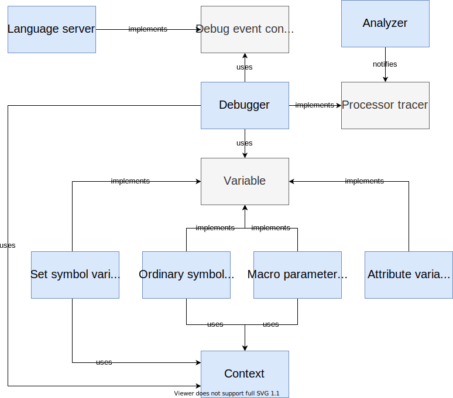

The macro tracer allows the user to track how the HLASM source code is assembled in experience similar to common debugging tools. The user is able to see step by step how CA instructions are interpreted and how macros are expanded.

This is achieved by implementing the Debug Adapter Protocol. The protocol itself is implemented in the language server component, which uses the macro tracer component.

DAP functionality mapping
-------------------------

The DAP was originally designed to communicate between an IDE or an editor and a debugger or a debug adapter. For example, when debugging a C++ application in Visual Studio Code, the editor communicates through DAP with a debugger that is attached to a compiled C++ application. Contrary to this, the macro tracer does not run with compiled binary, it only uses the analyzer to simulate the compilation process of high level assembler.

However, even though we are not implementing a real debugger, it makes very good sense to use a debugging interface for tracing the simulation. Parts of the debugging interface that we use in a macro tracer are as follows.

- **Instruction pointer**  
The instruction pointer is commonly shown in debuggers by highlighting a line of code that is going to be executed next. This is applicable to HLASM without change, since all the instructions are processed one by one in a well-defined order.

- **Breakpoints**  
The user can set a breakpoint when he is interested in tracing only particular section of the code. The compilation simulation will stop when it reaches a line with a breakpoint.

- **Continue**  
The user can restart a paused simulation by using the continue function just as in any debugger.

- **Step in and step over**  
In debuggers, it is possible to use step in / step over functions to debug an implementation of subroutine or to skip it and continue after the application returns from the subroutine. In HLASM, this can be applied to macros and COPY instructions: if the user is interested in what happens inside a macro or a COPY file, he can use step in. Step over skips to the next instruction in the same file.

- **Variables**  
The same way common debuggers show values of runtime variables, the macro tracer uses the same functionality to show values of set symbols, macro parameter values and ordinary symbols. It is also possible to visualize attributes of symbols.

- **Call stack**  
The call stack makes sense with the macro tracer too. It can show the stack of currently processed macros and COPY files. Moreover, macros have local set symbols and parameters, so each stack frame may show a different set of valid variables.

All described functionality (and more) is supported by the DAP.

Macro tracer architecture
-------------------------

The macro tracer architecture is shown above.

`Debugger` is a class that encapsulates all macro tracer functionality. It starts the standard analysis provided by the `analyzer` component in a special thread. The `debugger` implements the `processor_tracer` interface, which allows it to receive a notification every time a statement is about to be processed.

It is also the `debugger’s` responsibility to extract data from the `context` used by the `analyzer` and to transform them into a form compatible with the DAP.

`Debugger` uses an interface `variable` which represents the variable as it is shown to the user — most importantly, it is a name-value pair. The `variable` interface has four implementations:

-   `set_symbol_variable`
-   `ordinary_symbol_variable`
-   `macro_parameter_variable`
-   `attribute_variable`

First three represent a HLASM symbol of respectable type. They adapt the `context` representation of the symbols to DAP variables.

The `attribute_variable` represents attributes of all types of symbols. It does not access context, and it is only used by the rest of `variables` to show their attributes.

Debugger
--------

The `debugger` component is the core of the macro tracer implementation. When the user starts debugging, the method `launch` is called from the language server component. The `debugger` creates `analyzer` and starts the analysis in a separate thread. The `debugger` implements `processor_tracer` interface, which only has one method — `statement`. The `analyzer` calls the `statement` method every time a next statement is about to be processed.

This implementation makes it possible for the `debugger` to stop the analysis using a conditional variable. When it sees fit (e.g. when a breakpoint was hit), the `debugger` can put the thread to sleep and wait for further user interaction. At the same time, it notifies the language server through `debug_event_consumer` interface that the analysis has stopped.

There are three important structures in the DAP:

-   **Stack frame** Stack frame represents one item in the call stack. Each frame has a name that is shown to the user and points to a line in the source code. In the macro tracer, each frame points either to the next instruction, to a macro call or to a COPY instruction.

-   **Scope** Each stack frame may have scopes. A scope is simply a group of variables used to make them organized for the user. The macro tracer uses three scopes: local variables, global variables and ordinary symbols.

-   **Variable** Each scope has arbitrary number of variables. Each variable has a name and a value. They may be further structured and may have additional child variables. Therefore, the DAP can be used to present arbitrary tree of variables to the user. shows an example regarding nested macro parameters.

<!-- -->

    	MAC (foo,((bar,ex),am),ple,(lorem,ipsum))
    	
    	1: foo
    	2: ((bar,ex),am)
    	  1: (bar,ex)
    	    1: bar
    	    2: ex
    	  2: am
    	3: ple
    	4: (lorem,ipsum)
    	  1: lorem
    	  2: ipsum
    	
    	

While the thread is stopped, the editor sends requests to display information about the current context. It is the `debugger’s` responsibility to extract a list of stack frames from the context, return a list of scopes for each stack frame and a list of variables for each scope. It does not have to deal with the complexity of different types of set symbols and macro parameters, which is done by the implementations of the `variable` interface.