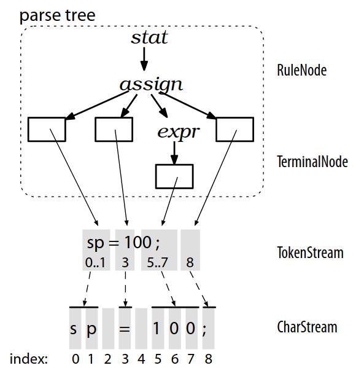

The project uses several third party libraries. Some of them are needed by language server to parse LSP messages and communicate through DAP. Also, we use a third party library to recognize syntax of HLASM.

- [**ASIO C++ library**](https://think-async.com/Asio/)  
Asio is a cross-platform C++ library for network and low-level I/O programming that provides developers with a consistent asynchronous model using a modern C++ approach. We use it to handle TCP communication in a cross-platform way. Asio implements std::iostream wrappers around the TCP stream, which allows us to abstract from the actual source of the communication.

- [**JSON for Modern C++**](https://github.com/nlohmann/json)  
We use JSON for Modern C++ library to parse and serialize JSON. It is used in both LSP and DAP. It allows us to seamlessly traverse input JSON and extract the interesting values, as well as easily respond with valid JSON messages.

- [**cpp-netlib URI**](https://github.com/cpp-netlib/uri)  
Cpp-netlib URI library is used for parsing URI specified by the [RFC3986](https://tools.ietf.org/html/rfc3986), which is used by the LSP and DAP protocols to transfer paths to files. It is the responsibility of the language server to parse the URIs and convert them to file paths, so it is easier to work with them in the parser library.

Usage of ANTLR4 within the project
----------------------------------

We have based part of our analyzer on ANTLR 4 parser generator. ANLTR 4 implements Adaptive LL(*) parsing strategy.

### Adaptive LL(\*) parsing strategy

Adaptive *LL(\*)* (or short *ALL(\*)*) parsing strategy is a combination of simple, efficient and predictable top-down *LL(k)* parsing strategy with power of *GLR* which can handle non-deterministic and ambiguous grammars. Authors move the grammar analysis to parse-time. This lets *ALL(\*)* handle any non-left-recursive context-free grammar rules and for efficiency it caches analysis results in lookahead DFA.

Theoretical time complexity can be viewed as a possible downside of *ALL(\*)*. Parsing of *n* symbols takes *O(n4)* in theory. In practice, however, *ALL(\*)* seems to outperform other parsers by order of magnitude.

Despite the theoretical *O*(*n*4) time complexity, it appears that the *ALL(\*)* behaves linear on most of the code, with no unpredictable performance or large footprint in practice. In order to support this, authors investigate the parse time vs file size for languages `C`, `Verilog`, `Erlang` and `Lua` files. They found very strong evidence of linearity on all tested languages (see the original paper for details).

### ANTLR 4 pipeline

ANTLR 4, similarly to any other conventional parser generator, processes the inputted code as follows: (1) breaks down the source string into tokens using *lexer* (2) builds parse trees using *parser* .

This pipeline in ANTLR 4 is broken into following classes:

- `CharStream`  
represents input code.

- `Lexer`  
breaks the inputted code into tokens.

- `Token`  
token representation that includes important information like token type, position in code or the actual text.

- `Parser`  
builds parse trees.

- `TokenStream`  
connects the lexer and parser.

The following picture sketches the described pipeline.

### ANTLR Parser

The input to ANTLR is a grammar written in antlr-specific language that specifies the syntax of HLASM language (see the 193 grammar rules in the [[Grammar visualization]]). The framework takes grammar and generates source code (in C++) for a recognizer, which is able to tell whether input source code is valid or not. Moreover, it is possible to assign a piece of code that executes every time a grammar rule is matched by the recognizer to further process the matched piece of code and produce helper structures (statements).

### Parse-Tree walking

ANTLR 4 offers two mechanisms for tree-walking: the parse-tree listeners and parse-tree visitors. The listener can only be used to get a notification for each matched grammar rule. The visitor lets the programmer control the walk by explicitly calling methods to visit children.

We employ the *visitor* approach during evaluation of CA expressions, because we need to have ampler control over the evaluation (such as operator priority).

The ANTLR 4 first generates `hlasmparserVisitor` and `hlasmparserBaseVisitor`. The former is an abstract class, the latter is a simple implementation of the former. Both classes define `visit` functions for every grammar rule. A visit function has exactly one argument — the context of the rule. The simple implementation executes `visitChildren()`. Our parse-tree visitor — the `expression_evaluator` — overrides `hlasmparserBaseVisitor`. In order to evaluate a sub-rule, we call `visit(ctx->sub_rule())`, where `ctx->sub_rule()` returns the context of the sub-rule. The `visit()` function matches appropriate function of the visitor based on the context type (for example, `visit(ctx->sub_rule())` would call `visiSub_rule(..)`).
