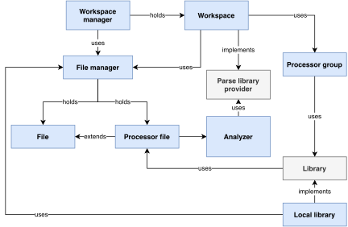
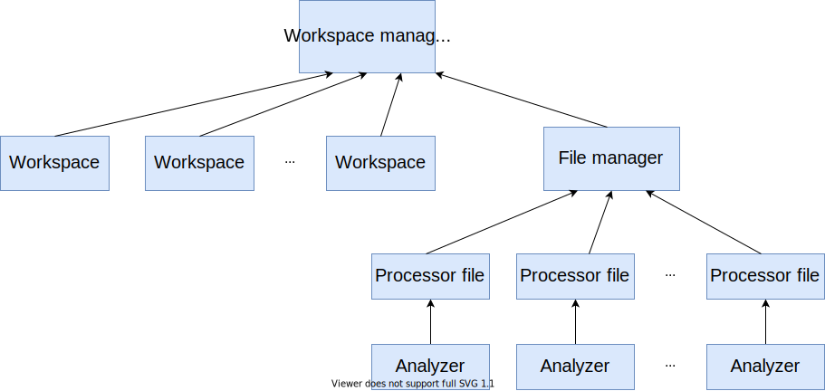

The architecture of the parser library (above) is organized into the following components:

- **Workspace Manager API**  
The workspace manager provides an API for handling workspace management (e.g. add new workspace), LSP and DAP requests. It can hold multiple workspaces and calls file manager to handle changes in the workspace files.

- **Workspace Representation**  
The representation of a workspace deals with the relationships between its files (dependencies) upon a parse request and propagates the parsing further into the analyzer. It also retrieves data from the configuration files, and is used for resolving dependency searches by implementing the parse library provider.

- **Processor Group Representation**  
The representation of a processor group uses the API of libraries to search for their dependencies. Currently, we only support local libraries, which use the file manager for their file information retrieval.

- **File Manager**  
The file manager is used by multiple components to handle file management and file searches. It also distinguishes and does conversions between regular files and processor files, which can be used for parsing.

- **[[Analyzer]]**  
The analyzer accepts a file along with the information needed for dependency resolution, syntactically and semantically processes it and fills the context tables. The component is further explained in \[chap:analyzer\].

The technical details of each component are further explained in the following sections.

Workspace Representation
------------------------

In VS Code, as in many other editors, a grouping of files for a single project is called the *workspace*. This notion simplifies the workflow with the project as all the needed files are concentrated in a single folder. For example, relative paths to the workspace can be used instead of absolute ones or custom settings can be applied to the particular project/workspace.

As the parser library follows the LSP, it also incorporates the notion of files organized into workspaces. Therefore, it has its own representation of a workspace.

The representation of a workspace is used by the workspace manager to handle various changes in the workspace. The workspace manager propagates LSP requests and notifications coming from the language server to the corresponding workspace and retrieves the results from it via the registered observers.

The workspace component uses the file manager for file searches, retrieves the values from the configuration files, creates processor groups, and is capable of resolving dependencies.

Due to the possibility to include files, the workspace maintains a list of dependants, which are active dependencies of other workspace files. The list of dependants is needed, for example, in case the user changes the contents of a macro that is used by multiple open code files, with all of them needing to be reparsed.

The core of the workspace is its `parse_file` method. As an addition to the parsing part, it also ensures that the file to be parsed, its dependencies and dependants provide consistent results. The method works as follows:

1.  It checks whether the parsed file is a configuration file. If so, the workspace reloads the configuration values and reparses all dependants in the workspace.

2.  In case the parsed file is not a configuration file, it creates a list of all files to be parsed. This list consists of files depending on the parsed file and the parsed file itself.

3.  The method reparses the files in this list and creates new dependants, based on the dependencies reported from the parsing.

4.  It checks for the files that are no longer in use (former dependencies) and closes them.

The workspace also ensures the correct closure of the file via the `didClose` method. This works as follows:

-   If the closed file is a dependency of some other file, it cannot be removed completely from the file manager, as it is still in use. The file manager is rather notified that the file was closed in the editor.

-   If it is not a dependency, the method checks for its dependants and closes them.

File Representation
-------------------

The file manager handles all file-related requests across different workspaces. It distinguishes between regular, non-HLASM files and processable, HLASM files by using different representations.

The representation of a regular file (called *file*) is capable of providing its file names, its contents and changing its state upon file-oriented LSP requests, i.e `didChange`, `didClose` and `didOpen`.

The representation of processor files is defined by the *processor_file* class, which derives from both *file* and *processor* abstract classes. The *processor* is an interface which is capable of actual processing (parsing). Its only implementation is processor file.

When the `parse` method is invoked, the processor file initializes new analyzer, uses it for the parsing and rebuilds its dependencies list, closing the unwanted ones. When the parsing is finished, it keeps the instance of the analyzer and provides its parsing results when requested.

Dependency Resolution
---------------------

Whenever a code from a different file is to be included, either via `COPY` instruction or a macro call, it is necessary to find the desired file first. During the parsing, the representation of libraries is already created according to the configurations. However, there is also a need for components that resolve the dependency by finding and parsing the corresponding library.

The *parse\_lib\_provider* interface exists for this purpose. Whenever a component is to be used for dependency resolution, it implements this interface.

The name of the needed file, the current context tables and the library data (the currently used type of processing) are passed to the `parse_library` method of the *parse_lib_provider* interface. The method finds the library file (i.e. a macro or COPY file) with the specified name and parses it with the given context.

The workspace is the most important implementation of the `parse_lib_provider` interface. It provides libraries based on the processor groups configuration described in [[configuration of libraries]].

Diagnostics
-----------

Diagnostics are used to indicate a problem with source files, such as a compiler error or a warning. Some diagnostics are created in almost every component of the parser when it finds a problem with a source code. Diagnostics are also used in workspace to indicate problems with configuration files. After each parsing, we need to collect all the diagnostics from all the instances of all the components and pass them to the language server.

The components capable of collecting the diagnostics are organized in a tree where the root is the workspace manager. Starting from the root, each component collects the diagnostics of those children that are again capable of collecting or generating diagnostics.

To enforce this behavior, all of these components implement the *diagnosable* interface. Its functionality is simple, it is used to add diagnostics, show its own, and collect them from other diagnosable members. Each component that implements the interface is required to collect diagnostics from diagnosable objects it owns. In the result, one call of `collect_diags` from the root of the tree collects all diagnostics that were created since the last call.

The diagnosable hierarchy of the workspace manager component is shown in the following picture:

